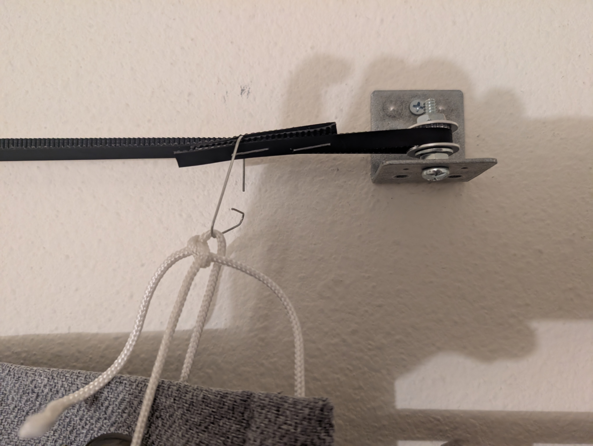
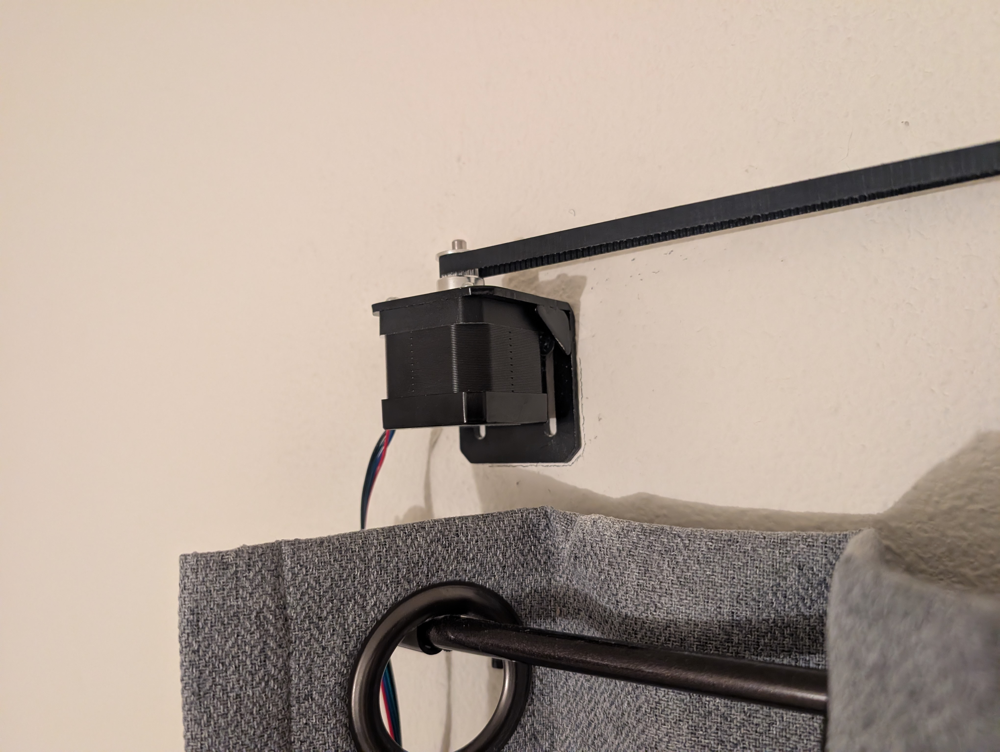
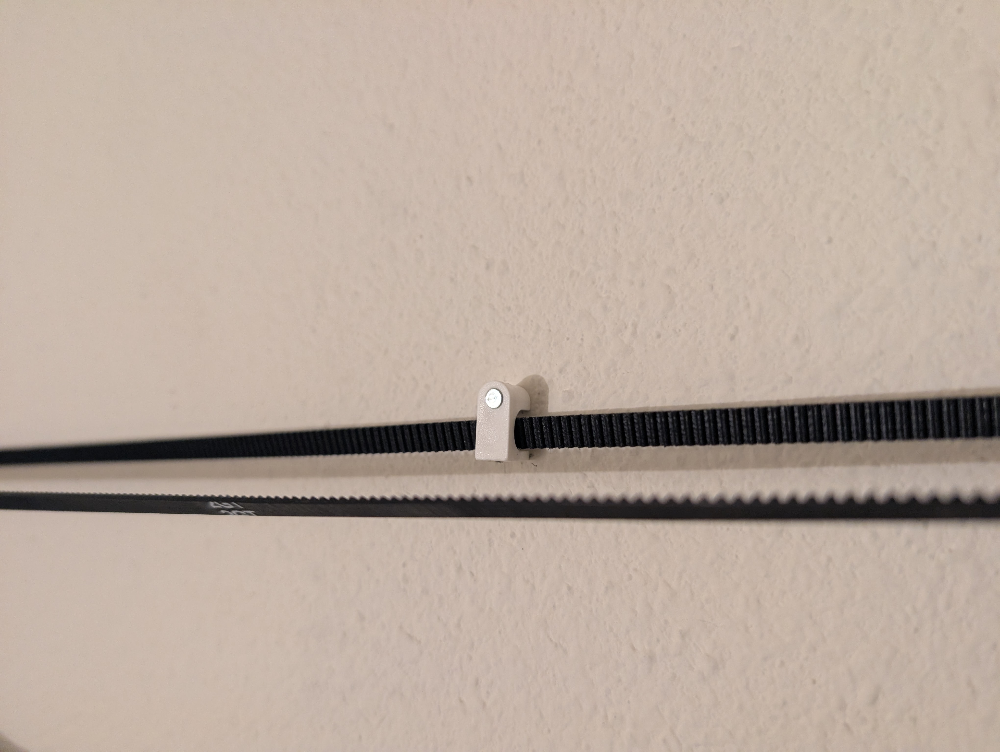
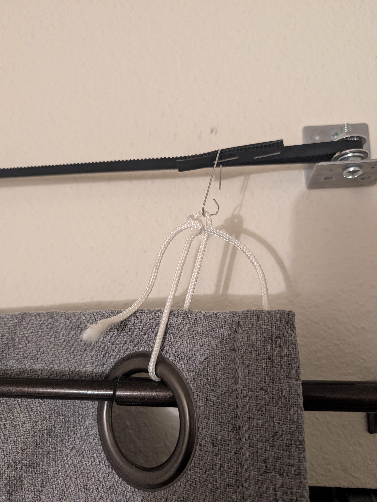
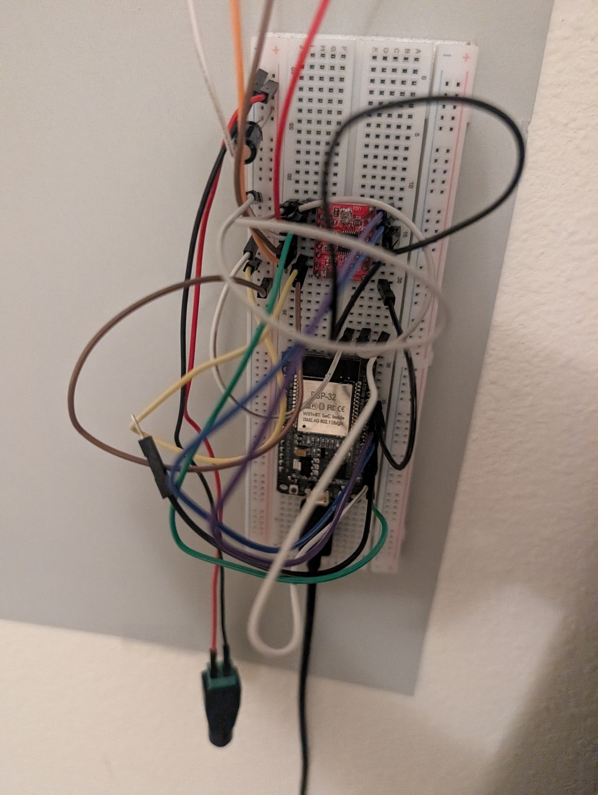

# ESP32 Automated Smart Curtain System

A smart home embedded system that automates window curtains using an ESP32 microcontroller, a NEMA 17 stepper motor, an A4988 driver, and a GT2 timing belt.

## Table of Contents
* [General Info](#general-info)
* [Screenshots & Diagrams](#screenshots--diagrams)
* [Technologies](#technologies)
* [Features](#features)
* [Setup & Installation](#setup--installation)
* [Hardware Wiring](#hardware-wiring)
* [Project Status](#project-status)
* [License](#license)

---

## General Info
The goal of this project is to automate traditional window curtains cleanly and reliably without relying on third-party cloud services, resulting in better quality of sleep and an optimal wake routine.

The firmware controls a stepper motor to pull a timing belt back and forth across a window track. It serves a lightweight web page directly from the ESP32's flash memory, letting you control the curtains and set daily open/close schedules from any phone or computer on your local network. It also includes a physical wall button override and uses smooth acceleration so the motor does not move the belt erratically.

---

## Screenshots & Demos

### Hardware Assembly & Components

<p align="center">
  
  <br>
  <em><!-- Caption for 01pulleybeltright.jpg: e.g., Right-side idler pulley and GT2 timing belt tensioner --></em>
</p>

<p align="center">
  
  <br>
  <em><!-- Caption for 02motor.jpg: e.g., NEMA 17 stepper motor installed on custom bracket --></em>
</p>

<p align="center">
  
  <br>
  <em><!-- Caption for 03beltstabilizer.jpg: e.g., Mid-span belt stabilizer clip keeping GT2 alignment --></em>
</p>

<p align="center">
  
  <br>
  <em><!-- Caption for 04curtainconnect.jpg: e.g., Mechanical drapery fastener clamped to the timing belt loop --></em>
</p>

<p align="center">
  
  <br>
  <em><!-- Caption for 05breadboard.jpg: e.g., Breadboard wiring for the ESP32, A4988 driver, and power distribution --></em>
</p>

---

### Video Demonstrations

#### Web Console Interface (6s)
<p align="center">
  <video src="assets/vid01webpage%20(2).mp4" controls width="650"></video>
  <br>
  <em><!-- Caption for vid01webpage (2).mp4: e.g., Web dashboard boot routine and real-time live terminal stream --></em>
</p>

#### Curtain Opening Cycle (44s)
<p align="center">
  <video src="assets/vid02curtopen%20(1).mp4" controls width="650"></video>
  <br>
  <em><!-- Caption for vid02curtopen (1).mp4: e.g., Full 44-second curtain open cycle with smooth acceleration profile --></em>
</p>

#### Curtain Closing Cycle (40s)
<p align="center">
  <video src="assets/vid03curtclose%20(1).mp4" controls width="650"></video>
  <br>
  <em><!-- Caption for vid03curtclose (1).mp4: e.g., 40-second curtain close cycle and limit positioning --></em>
</p>

---

## Technologies
Project is created with:
* **C++ / Arduino Framework** for ESP32
* **PlatformIO** build system
* **ESP32 Preferences Library:** Non-Volatile Storage (NVS) for persistent settings
* **WebServer & WiFi Libraries:** Embedded local HTTP server
* **NTP (Network Time Protocol):** Internet-synchronized clock for scheduled events
* **HTML5 / Modern JavaScript (ES6):** Responsive, single-page web dashboard without external CDNs

---

## Features
***Smooth Acceleration Curve:** Uses a trapezoidal speed profile (gradually speeding up and slowing down) to prevent belt slip and motor stalls.
    **Motion Speed Control Breakdown:**
    To prevent the heavy curtain from skipping steps or slipping the belt, the firmware adjusts the pause time between step      pulses so the motor speeds up and slows down gradually:
    
    **FORMULA: Delay = DelayMax - (CurrentStep / RampSteps) * (DelayMax - DelayMin)**
    
    **VARIABLES:**
    * **Delay:** The wait time in microseconds (us) between motor pulses. A shorter delay means the motor spins faster.
    * **CurrentStep:** Which step the motor is currently on during acceleration (from 0 to 400).
    * **DelayMax (10,000 us):** Starting speed. A long pause makes the motor turn slowly with high torque to get the heavy curtain moving from a dead stop.
    * **DelayMin (5,000 us):** Top cruising speed once the curtain is rolling.
    * **RampSteps (400 steps):** The number of steps the motor takes to ramp up from start to full speed.
* **Responsive Web Dashboard:** Uses a cooperative `yieldCallback` every 150 motor steps so the web server handles button clicks and status updates mid-transit without freezing.
* **Persistent Settings:** Saves current position and daily schedules to internal flash storage (NVS), so settings are kept even after a power outage.
* **Driver Overheating Protection:** De-energizes the A4988 motor coils (`ENABLE` pin) whenever the curtain is stopped to eliminate idle heat buildup.
* **Manual Button Control:** Software-debounced physical switch on the wall allows anyone to toggle the curtains open or closed.

---

## Setup & Installation

### Requirements
* VS Code with the [PlatformIO IDE](https://platformio.org/) extension
* ESP32 DevKit board with micro-USB cable
* 12V DC power supply for the stepper motor

### Quick Start
1. **Clone the repository:**
   ```bash
   git clone [https://github.com/spranadi/esp32-automated-smart-curtain.git](https://github.com/spranadi/esp32-automated-smart-curtain.git)
   cd esp32-automated-smart-curtain
   ```

2. **Add your Wi-Fi credentials:**
   Copy the example configuration file:
   ```bash
   cp include/sensitive.example.h include/sensitive.h
   ```
   Open `include/sensitive.h` in your editor and enter your Wi-Fi network name and password:
   ```cpp
   #pragma once
   #define WIFI_SSID     "YOUR_WIFI_NAME"
   #define WIFI_PASSWORD "YOUR_WIFI_PASSWORD"
   ```

3. **Build and upload:**
   Connect your ESP32 to your computer and run:
   ```bash
   pio run --target upload
   ```

4. **Find your device's IP:**
   Open the PlatformIO Serial Monitor at `115200` baud:
   ```bash
   pio device monitor -b 115200
   ```
   Verify the assigned IP address (e.g., `192.168.1.50`) and enter it into any browser on the same Wi-Fi network to open the control interface webpage.

---

## Hardware Wiring

| Hardware Pin | ESP32 GPIO | Purpose |
|---|---|---|
| A4988 `STEP` | GPIO 18 | Step pulse signal |
| A4988 `DIR` | GPIO 19 | Direction selection |
| A4988 `ENABLE` | GPIO 21 | Coil power gating (Active-LOW: 0 = On, 1 = Off) |
| A4988 `VDD` | 3V3 Rail | Logic voltage supply |
| Pushbutton | GPIO 4 | Manual toggle button (`INPUT_PULLUP` to Ground) |
| A4988 `VMOT` | 12V Supply | High-voltage motor rail (requires 100 µF cap across GND) |
| Motor Coils | A4988 1A, 2A, 1B, 2B | 4-wire bipolar NEMA 17 connection |

> **Safety Note:** Connect a 100 µF capacitor across `VMOT` and `GND` close to the A4988 board to prevent voltage spikes. Connect driver `RESET` directly to `SLEEP`.

---

## Project Status
Project is: **Completed & Maintained**. 

**Future Roadmap Ideas:**
- Integrate machine learning to provide automatic scheduling based on normal routines.

---

## License
Distributed under the MIT License. See `LICENSE` for more information.
```
